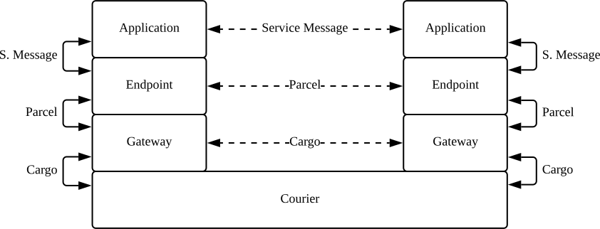
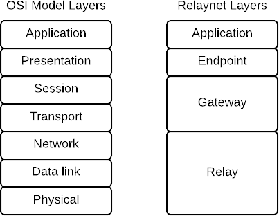
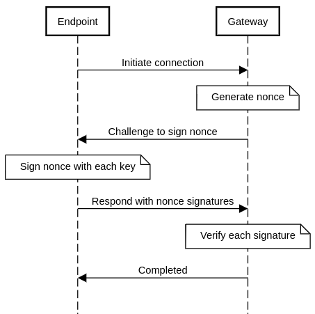
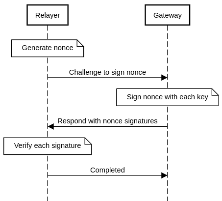

# Relaynet Core
{: .no_toc }

- Id: RS-000.
- Status: Working draft.
- Type: Implementation.

## Abstract
{: .no_toc }

This document describes the core elements of the Relaynet protocol suite, whose purpose is to make distributed systems tolerant to potentially large network latencies through the use of [asynchronous messaging](https://www.techopedia.com/definition/26454/asynchronous-messaging).

## Table of contents
{: .no_toc }

1. TOC
{:toc}

## Introduction

Distributed systems are typically integrated using some form of [Remote Procedure Call (RPC)](https://en.wikipedia.org/wiki/Remote_procedure_call), a seemingly simple and familiar pattern that resembles local function calls in programming. Systems communicating over HTTP, such as REST or gRPC APIs, employ this pattern.

RPCs work well in a reliable network -- One with a low [round-trip time (RTT)](https://en.wikipedia.org/wiki/Round-trip_delay_time) and an adequate [throughput](https://en.wikipedia.org/wiki/Throughput). But the component making the call becomes more complicated with the need to implement retries, timeouts and [circuit breakers](https://martinfowler.com/bliki/CircuitBreaker.html) in order to cope with an unusually high RTT or an unusually low throughput. And with an extremely high RRT and/or an extremely low throughput, RPCs do not work at all.

In contrast to RPCs, distributed systems using asynchronous messaging are implemented without any assumption that the data will reach its destination immediately or that a response will be returned. Instead, they communicate through [_brokers_](https://en.wikipedia.org/wiki/Message_broker) that receive, route and deliver the data.

Decoupling the two nodes in the connection makes it possible to transport the data using alternative methods when the network unavailable. For example, in places where [sneakernets](https://en.wikipedia.org/wiki/Sneakernet) are used to consume foreign content, people could also use it to connect their applications to the Internet if those applications were tolerant to large RTTs.

Relaynet makes it easy to build distributed systems using asynchronous messaging in such a way that data can be securely transported on alternative media (e.g., sneakernets) when a conventional computer network is unavailable. The result is a [delay-tolerant](https://en.wikipedia.org/wiki/Delay-tolerant_networking), [overlay](https://en.wikipedia.org/wiki/Overlay_network) network with [onion routing](https://en.wikipedia.org/wiki/Onion_routing).

Asynchronous messaging also happens to be a better integration style, for reasons that Hohpe and Woolf eloquently summarize in [Enterprise Integration Patterns](https://en.wikipedia.org/wiki/Enterprise_Integration_Patterns) (page 54):

> Asynchronous messaging is fundamentally a pragmatic reaction to the problems of distributed systems. Sending a message does not require both systems to be up and ready at the same time. Furthermore, thinking about the communication in an asynchronous manner forces developers to recognize that working with a remote application is slower, which encourages design of components with high cohesion (lots of work locally) and low adhesion (selective work remotely).

## Concepts

The following diagram illustrates the various components of the network and how they interact with each other:



- A **service** is a collection of _applications_ that communicate amongst themselves. A service can be centralized (client-server) or decentralized (peer-to-peer).
- **Applications** exchange _messages_ amongst themselves, and because they can't communicate directly, they each use an _endpoint_ as a broker.
- A **(service) message** is serialized in the format determined by the service and does not have to be encrypted or signed.
- An **endpoint** receives a message from its application and converts it into a _parcel_ for the target application's endpoint, and because they still can't communicate directly, they each use a _gateway_ as a broker. When an endpoint receives a parcel from the gateway, it has to decrypt the message and pass it to its application.
- A **parcel** encapsulates exactly one service message, which is encrypted with the target endpoint's certificate and signed with the origin endpoint's key.
- A **gateway** receives parcels from endpoints and puts them into cargo for another gateway, using a _relayer_ as a broker. When a gateway receives cargo from a relayer, it decrypts the cargo and delivers the encapsulated parcels to their corresponding target endpoints.
  - A **user gateway** is a specific type of gateway that runs on a end-user device and serves the endpoints on that device.
  - A **relaying gateway** is a specific type of gateway that allows the endpoints behind its user gateways to reach another network (typically the Internet).
- A **cargo** encapsulates one or more parcels, and it is encrypted with the target gateway's certificate and signed with the origin gateway's key.
- The **relay layer** represents the underlying network that transports the cargo between gateways. It could be the Internet, a sneakernet or a [scatternet](https://en.wikipedia.org/wiki/Scatternet), for example. 
- A **relayer** is the individual or organization that operates the relay layer. For example, in a sneakernet, it is the individual or group that transports the cargo between user gateways and a relaying gateway.

For example, if Twitter supported Relaynet, Twitter would be the _service_, the Twitter mobile apps would be _applications_ and the Twitter API would be another _application_. The _endpoints_ in the mobile apps could simply be Java (Android) or Swift (iOS) libraries, whilst the _endpoint_ in the Twitter API could be a new API endpoint (e.g., `https://api.twitter.com/relaynet`).

Relaynet can also be described in terms of the [OSI model](https://en.wikipedia.org/wiki/OSI_model) as shown in the diagram below -- With [same-layer and adjacent-layer interactions](https://upskilld.com/learn/same-layer-and-adjacent-layer-interactions/) defined by [_messaging protocols_](#messaging-protocols) and [_message transport bindings_](#message-transport-bindings), respectively.



Note that defining same-layer interactions at the application and relay layers is outside the scope of the protocol suite. Relaynet only prescribes the interactions with their adjacent layers. Each service has full control over its applications (see [_service messaging protocol_](#service-messaging-protocol)), and each relayer has full control over its relay layer.

## Addressing

This document only defines [point-to-point](https://www.enterpriseintegrationpatterns.com/patterns/messaging/PointToPointChannel.html) message delivery. [Service Message Broadcast (RS-013)](rs013-pubsub.md) defines a [publish-subscribe](https://www.enterpriseintegrationpatterns.com/patterns/messaging/PublishSubscribeChannel.html) protocol.

Each endpoint and gateway in Relaynet MUST have a unique, opaque address known as _private address_. It MAY also have a unique internet address known as _public address_ if the node can be reached by host/port. A nodes is public if it has a public address, otherwise it is private.

The private address of a node MUST equal to the digest of its public key, computed as `"0" || sha256(publicKey)`, where the `0` (zero) prefix denotes the version of the address format defined in this document, `||` denotes the concatenation of two strings, `publicKey` is the DER encoding of the `SubjectPublicKeyInfo` structure from [RFC 5280](https://tools.ietf.org/html/rfc5280) and `sha256()` outputs the SHA-256 digest in hexadecimal. For example, `0b5bb9d8014a0f9b1d61e21e796d78dccdf1352f23cd32812f4850b878ae4944c` is a valid private address.

A public address MUST be a valid [Uniform Resource Identifier (URI)](https://tools.ietf.org/html/rfc3986) that meets the following constraints:

- The scheme MUST be determined by the [messaging protocol](#messaging-protocols) and MAY be followed by the [binding](#message-transport-bindings) (with a plus sign separating the two). If the binding is absent, [Application-Level Protocol Negotiation](https://en.wikipedia.org/wiki/Application-Layer_Protocol_Negotiation) MUST be done.
- The address MUST NOT contain a fragment.

## Messaging Protocols

These protocols establish the corresponding [_channels_](https://www.enterpriseintegrationpatterns.com/patterns/messaging/MessageChannel.html) for applications, endpoints and gateways. Building on the OSI model mapping above, these protocols define the [same-layer interactions](https://upskilld.com/learn/same-layer-and-adjacent-layer-interactions/).

Endpoints and gateways MUST comply with the [Relaynet PKI profile](rs002-pki.md), which specifies the use of certificates in these protocols. The [Internet PKI profile](https://tools.ietf.org/html/rfc5280) does not apply to messaging protocols.

### Service Messaging Protocol

This protocol establishes the channel between two applications in a service. The _service provider_ has full control over this protocol, including the types of messages that its applications exchange (their contents, serialization format, etc).

Applications MAY provision [_Parcel Delivery Authorizations_ (PDAs)](rs002-pki.md#parcel-delivery-authorization-pda) from their corresponding endpoints. PDAs MUST be encapsulated in service messages; for example, an application sends a message to another application in order to subscribe to updates, the authorizing application could attach the PDA to the message.

### Endpoint Messaging Protocol

This protocol establishes the channel between two endpoints. The only type of message that this specification defines at this level is the [_parcel_](#parcel).

Public endpoint addresses MUST use the scheme `rne`. For example, `rne://example.com` or `rne+http://example.com` (if using the [PoHTTP binding](rs007-pohttp.md)) are valid public endpoint addresses.

#### Parcel

A parcel encapsulates a service message and is serialized with the [Relaynet Abstract Message Format (RAMF)](rs001-ramf.md), using the octet `0x50` ("P" in ASCII) as its _concrete message format signature_. Gateways and the target endpoint MUST enforce the post-deserialization validation listed in the RAMF specification.

The sender certificate MUST be a valid certificate per [Relaynet PKI](rs002-pki.md).

The payload [ciphertext](https://en.wikipedia.org/wiki/Ciphertext) MUST be encapsulated as a [CMS enveloped data](https://tools.ietf.org/html/rfc5652#section-6) value with exactly one recipient (`RecipientInfo`) using the [Relaynet Channel Session Protocol](rs003-key-agreement.md); when the channel session protocol cannot be used, the payload MAY be encrypted with the public key in target endpoint's certificate (the `KeyTransRecipientInfo` choice in CMS). Extensions to this document MAY support additional CMS structures.

The payload [plaintext](https://en.wikipedia.org/wiki/Plaintext) contains the service message and its media type, and is serialized with the following binary sequence (little-endian):

1. An 8-bit unsigned integer (1 octet) representing the length of the service message type.
1. A UTF-8 encoded string representing the type of the service message. For example, `application/x-protobuf; messageType="twitter.Tweet"`.
1. A 32-bit unsigned integer (4 octets) representing the length of the service message.
1. The service message serialized in the format dictated by the service.

### Gateway Messaging Protocol

This protocol establishes the channel between two gateways.

Public gateway addresses MUST use the scheme `rng`. For example, `rng://example.com` and `rng+socket://example.com` (if using the [CoSocket binding](rs004-cosocket.md)) are valid public gateway addresses.

When using the [Relaynet Key Agreement protocol](rs003-key-agreement.md), the two gateways MUST maintain a single session across the different message types.

#### Cargo

Its primary purpose is to encapsulate one or more messages from the [endpoint channel](#endpoint-messaging-protocol) (e.g., parcels). Cargoes are serialized as RAMF, using the octet `0x43` ("C" in ASCII) as its concrete message format signature. Relayers and gateways MUST enforce the post-deserialization validation listed in the RAMF specification.

The payload [ciphertext](https://en.wikipedia.org/wiki/Ciphertext) MUST be encoded as a [CMS enveloped data](https://tools.ietf.org/html/rfc5652#section-6) using the [Relaynet Channel Session Protocol](rs003-key-agreement.md) (`KeyAgreeRecipientInfo`). Extensions to this document MAY support additional CMS structures.

The payload [plaintext](https://en.wikipedia.org/wiki/Plaintext) contains one or more parcels, and is serialized with the following binary sequence (in little-endian), which is repeated for each parcel:

1. A 32-bit unsigned integer (4 octets) representing the length of the parcel.
1. The parcel serialized in the RAMF.

#### Cargo Collection Authorization (CCA)

A RAMF message whereby Gateway A allows a relayer to collect cargo on its behalf from Gateway B. Its concrete message format signature is the octet `0x44`. This is to be eventually used as described in the [cargo relay binding](#cargo-relay-binding).

The payload [ciphertext](https://en.wikipedia.org/wiki/Ciphertext) MUST be encoded as a [CMS enveloped data](https://tools.ietf.org/html/rfc5652#section-6) value with exactly one recipient (`RecipientInfo`), using either the target gateway's certificate (`KeyTransRecipientInfo`) or the [Relaynet Key Agreement protocol](rs003-key-agreement.md) parameters (`KeyAgreeRecipientInfo`).

Its payload plaintext MUST contain the following information:

- Any [_Parcel Delivery Deauthorizations_ (PDD)](rs002-pki.md#parcel-delivery-deauthorization-pdd) issued by Gateway A's endpoints or Gateway A itself to revoke [PDAs](rs002-pki.md#parcel-delivery-authorization-pda).
- Binding-level constraints to authenticate the relayer, like expecting a specific _Certificate Authority_ in its TLS certificate chain (or equivalent). Gateway B MUST close the connection if these constraints are not met.

The payload plaintext MUST be serialized with [Protocol Buffers v3](https://developers.google.com/protocol-buffers/docs/proto3) using the `CargoCollectionAuthorization` message as defined below:

```proto
syntax = "proto3";

package relaynet.messaging.gateway;

import "google/protobuf/any.proto";
import "google/protobuf/timestamp.proto";

message CargoCollectionAuthorization {
    repeated ParcelDeliveryDeauthorization parcel_delivery_deauthorizations = 1;

    // The key MUST be the name of the binding (lower case) and the value MUST
    // be defined by the binding.
    map<string, google.protobuf.Any> relayer_constraints = 2;
}

message ParcelDeliveryDeauthorization {
    string endpoint_address = 1;
    string pda_serial_numbers = 2;
    google.protobuf.Timestamp expiry = 3;
}
```

## Message Transport Bindings

A message transport binding, or simply _binding_, defines the [adjacent-layer interactions](https://upskilld.com/learn/same-layer-and-adjacent-layer-interactions/) in Relaynet. [Parcel delivery bindings](#parcel-delivery-binding) define the communication between endpoints and gateways, and [cargo relay bindings](#cargo-relay-binding) define the communication between gateways and relayers. This document describes the requirements applicable to all bindings, but does not define any concrete binding.

Bindings will typically leverage [Layer 7](https://en.wikipedia.org/wiki/Application_layer) protocols, such as HTTP or purpose-built ones, but they can also use an Inter-Process Communication (IPC) mechanism provided by the host system.

Communication MUST be encrypted when the two nodes are on different computers, otherwise it is optional. Communication happens on the same computer when either the loopback network interface (i.e., addresses in the range `127.0.0.0/8`) or IPC is used. When encryption is used, it SHOULD be provided by Transport Layer Security (TLS) per the [Internet PKI profile](https://tools.ietf.org/html/rfc5280) or an equivalent technology (e.g., [DTLS](https://en.wikipedia.org/wiki/Datagram_Transport_Layer_Security)). Note that different asymmetric keys are required because [Relaynet PKI](rs002-pki.md) certificates cannot be used as server- or client-side certificates in TLS or DTLS.

For performance reasons, nodes SHOULD use Unix domain sockets or any other IPC mechanism when they are on the same computer, instead of using the loopback network interface.

Bindings MAY extend this specification, but they MUST NOT override it.

### Parcel Delivery Binding

This is a protocol that establishes a _Parcel Delivery Connection_ (PDC) between an endpoint and a gateway, with the primary purpose of exchanging parcels bidirectionally.

The node delivering a parcel MUST NOT remove it until the peer has acknowledged its receipt. The acknowledgement MUST be sent after the parcel is safely stored -- Consequently, if the parcel is being saved to disk, its receipt MUST be acknowledged after calling [`fdatasync`](https://linux.die.net/man/2/fdatasync).

Gateways MUST override any previously queued parcel with the same id. Endpoints can use this to replace stale messages in the same relay -- For example, an application sending a message to replace the user's email address could use this to discard any previous message to replace this value.

Each binding MUST support _internal_ or _external_ PDCs, or both.

#### External PDC

A PDC is _external_ if the gateway is a relaying gateway. Typically, both nodes will be public, but in some cases the relaying gateway may be private. In these connections,

- Either node MAY act as client or server.
- The gateway and the endpoint MAY only deliver parcels to each other and they MUST NOT attempt to collect parcels from each other. In other words, the endpoint has to initiate a connection to be able to send parcels to the gateway, whilst the  gateway has to initiate a connection to be able to send parcels to the endpoint.
- The server MUST NOT require client authentication, but they MAY still refuse requests from suspicious and/or ill-behaved clients.
- The gateway SHOULD include its address when it delivers parcels to the endpoint, but only if the gateway is able to collect parcels for the endpoint that sent the initial parcel.
- The connection MUST be closed as soon as all parcels have been delivered.

#### Internal PDC

A PDC is _internal_ if the gateway is a user gateway. Typically, both nodes will be private and run on the same computer, but they might also be public and run on different computers in a private network. In addition to both nodes being able to send parcels to each other, the endpoint MAY also:

- Request a certificate from the gateway, so the endpoint can issue PDAs.
- Send PDDs to the gateway, to revoke previously issued PDAs.

The endpoint MUST initiate the connection with the gateway. To find which binding to use and the address for the gateway, the endpoint MUST get the _Gateway Connection URL_. For example, the Gateway Connection URL `ws://127.0.0.1/path` specifies [PoWebSocket](rs016-powebsocket.md) as the binding and `127.0.0.1:80/path` as the WebSocket address of the gateway. The endpoint MUST get the connection URL from one of the following places, sorted by precedence:

1. Its application. For example, the end-user might have set the URL.
1. The environment variable `RELAYNET_GATEWAY_URL`.
1. The file `/etc/relaynet-gateway` on Unix-like systems or `C:\Windows\System32\Drivers\etc\relaynet-gateway` on Windows.

The server SHOULD listen on a system port (one in the range 0-1023). Alternatively, if using Unix domain sockets, the endpoint SHOULD NOT initiate a connection if the socket is owned by a user other than the administrator (`root` in Unix-like systems).

As soon as the connection is established, a handshake MUST be performed for the gateway to authenticate the endpoint. The endpoint will be challenged to sign a nonce with each Relaynet PKI key it claims to have, as shown in the following sequence diagram.



The connection MUST be closed if the handshake fails. Once the handshake completes successfully, the connection SHOULD remain open for as long as the two nodes are running.

Note that only the endpoint is authenticated because the gateway needs to make sure that it is delivering the parcel to the right endpoint, especially because it has to destroy its copy of the parcel upon delivery. The gateway can be trusted because it is set by the end-user or systems administrator, and TLS (or equivalent) has to be used anyway if the gateway is on a different computer.

The gateway MUST NOT start delivering parcels until the endpoint has signalled that it is ready to collect them -- The endpoint could be connecting to the gateway just to deliver one or more parcels, and it may not intend to collect any parcels.

### Cargo Relay Binding

This is a protocol that establishes a _Cargo Relay Connection_ (CRC) between a gateway and a relayer with the primary purpose of exchanging cargo bidirectionally.

The action of transmitting a cargo over a CRC is called _hop_, and the action of transmitting a cargo from its origin gateway to its target gateway is _relay_. There are usually two hops in a relay: One from the origin gateway to the relayer, and another from the relayer to the target gateway. A relaying gateway receiving cargo for another gateway MAY _forward_ it to its target gateway, which would involve an extra hop.

Completing one relay MAY involve hops with different bindings. For example, the CRC between a user gateway and a relayer could use [CoSocket](rs004-cosocket.md), whilst the CRC between the relayer and the relaying gateway could use [CogRPC](rs008-cogrpc.md).

The node sending a cargo MUST NOT remove it until the peer has acknowledged its receipt. The acknowledgement MUST be sent after the cargo is safely stored -- Consequently, if the cargo is being saved to disk, its receipt MUST be acknowledged after calling [`fdatasync`](https://linux.die.net/man/2/fdatasync).

A gateway MAY provide the relayer with a CCA so that the relayer can collect cargo from its peer gateway.

A user gateway MAY require the relayer to provide a CCA from the relaying gateway, but a relaying gateway MUST require at least one CCA because:

- The relaying gateway needs the user gateway's certificate to identify the parcels that belong to the user gateway (user gateway's certificate is part of the PDA).
- The relaying gateway could not delete a cargo after delivering it if it does not have some guarantee that the cargo could reach its destination.

The relayer SHOULD deliver the cargo and then wait a few seconds before collecting cargo from the gateway, in case there are any responses to the messages in the cargo that was delivered.

When the connection spans different computers, the relayer MUST initiate a handshake with the gateway by having it sign a nonce with each Relaynet PKI key it claims to have, as shown in the following sequence diagram. (The CRC could be local to a computer if, for example, the cargo is being directly saved to and retrieved from a storage media.)



Note that relayers are not assigned Relaynet PKI certificates, but per the requirements above for bindings in general, TLS certificates or equivalent must be used when the connection spans different computers. In such cases, the relayer MUST provide a valid client- or server-side certificate when it acts as client or server, respectively, and the gateway MUST enforce any authentication-related constraints placed by its peer gateway in the CCA (e.g., which Certificate Authorities should be regarded valid).

## Open Questions

- Which errors (if any) should be propagated to the message sender? And how?
  - Errors include: Message expired, invalid sender certificate, unauthorized sender, malformed message, unavailable target.
  - We need to distinguish channel-level errors (i.e., [_invalid message channel_ in EIP](https://www.enterpriseintegrationpatterns.com/patterns/messaging/InvalidMessageChannel.html)) from transport-level errors (i.e., [_dead letter channel_ in EIP](https://www.enterpriseintegrationpatterns.com/patterns/messaging/DeadLetterChannel.html)).
- How should the Gateway Connection URL be discovered on Android and iOS? A clean solution could be having a fixed binding (e.g., PoWebSocket) and URL (e.g., `ws://localhost:1234`).
- Should the CCA be encoded with DER instead of Protocol Buffers since ASN.1/DER serialization is already necessary for the Relaynet PKI?
- This specification only defines how to make Relaynet work on sneakernets. Maybe all the definitions specific to sneakernets should be moved to a separate spec so the core spec is agnostic of the relay layer? Using the Internet as the relay layer is already in a separate spec ([RS-017](rs017-adaptive-relay.md)).
