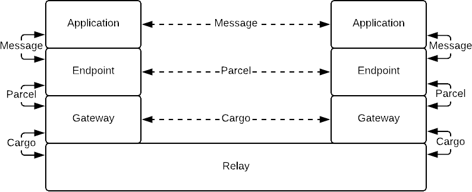
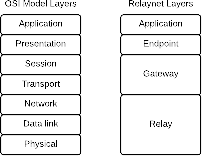

# Relaynet Core

- Id: RS-000.
- Status: Working draft.
- Type: Implementation.

## Abstract

This document describes the core elements of the Relaynet protocol suite, whose purpose is to make distributed systems tolerant to potentially large network latencies through the use of [asynchronous messaging](https://www.techopedia.com/definition/26454/asynchronous-messaging).

## Introduction

Distributed systems are typically integrated using some form of [Remote Procedure Call (RPC)](https://en.wikipedia.org/wiki/Remote_procedure_call), a seemingly simple and familiar pattern that resembles local function calls in programming. Services running on HTTP, such as RESTful or gRPC APIs, employ this pattern.

RPCs work well in a reliable network -- One with a low [round-trip time (RTT)](https://en.wikipedia.org/wiki/Round-trip_delay_time) and an adequate [throughput](https://en.wikipedia.org/wiki/Throughput). The higher the RRT or the lower throughput can be, the more complicated an RPC implementation becomes. And with an extremely high RRT and/or an extremely low throughput, RPCs do not work at all.

In contrast to RPCs, asynchronous messaging does not depend on a reliable network as it does not require the two nodes to be directly connected. It does, however, require the introduction of a [broker](https://en.wikipedia.org/wiki/Message_broker) to queue and dispatch messages. It also happens to be a better integration style, for reasons that Hohpe and Woolf eloquently summarize in [Enterprise Integration Patterns](https://en.wikipedia.org/wiki/Enterprise_Integration_Patterns) (page 54):

> Asynchronous messaging is fundamentally a pragmatic reaction to the problems of distributed systems. Sending a message does not require both systems to be up and ready at the same time. Furthermore, thinking about the communication in an asynchronous manner forces developers to recognize that working with a remote application is slower, which encourages design of components with high cohesion (lots of work locally) and low adhesion (selective work remotely).

Given the ubiquity of the RPC integration style, societies with access to computers or smartphones but no (reliable) Internet access are kept from using the Internet. The best they can hope for is a [sneakernet](https://en.wikipedia.org/wiki/Sneakernet) that provides them with limited, curated content.

Relaynet is designed to change that through the use of asynchronous messaging, and by leveraging alternative methods like sneakernets to transport data to and from the Internet in a secure manner. The result is a [delay-tolerant](https://en.wikipedia.org/wiki/Delay-tolerant_networking), [overlay](https://en.wikipedia.org/wiki/Overlay_network) network with [onion routing](https://en.wikipedia.org/wiki/Onion_routing).

## Concepts

The following diagram illustrates the various components of the network and how they interact with each other:



- A **service** is a collection of _applications_ that communicate amongst themselves. A service can be centralized (client-server) or decentralized (peer-to-peer).
- **Applications** exchange _messages_ amongst themselves, and because they can't communicate directly, they each use an _endpoint_ as a broker.
- A **(service) message** is serialized in the format determined by the service and does not have to be encrypted or signed.
- An **endpoint** receives a message from its application and converts it into a _parcel_ for the target application's endpoint, and because they still can't communicate directly, they each use a _gateway_ as a broker. When an endpoint receives a parcel from the gateway, it has to decrypt the message and pass it to its application.
- A **parcel** encapsulates exactly one service message, which is encrypted with the target endpoint's certificate and signed with the origin endpoint's key.
- A **gateway** receives parcels from endpoints and puts them into cargo for another gateway, using a _relayer_ as a broker. When a gateway receives cargo from a relayer, it decrypts the parcels and delivers them to their corresponding target endpoints.
- A **cargo** encapsulates one or more parcels, encrypted with the target gateway's certificate and signed with the origin gateway's key.
- A **relayer** _relays_ cargo from one gateway to one or more gateways.

For example, if Twitter supported Relaynet, Twitter would be the _service_, the Twitter mobile apps would be _applications_, the Twitter API would also be an _application_. The _endpoints_ in the mobile apps could simply be Java (Android) or Swift (iOS) libraries, whilst the _endpoint_ in the Twitter API could be a new API endpoint (e.g., `https://api.twitter.com/relaynet`).

Relaynet can also be described in terms of the [OSI model](https://en.wikipedia.org/wiki/OSI_model) as shown in the diagram below -- With [same-layer and adjacent-layer interactions](https://upskilld.com/learn/same-layer-and-adjacent-layer-interactions/) defined by [_messaging protocols_](#messaging-protocols) and [_message transport bindings_](#message-transport-bindings), respectively.



Note that defining same-layer interactions at the application and relay layers is outside the scope of the protocol suite. Relaynet only prescribes the interactions with their adjacent layers. Each service has full control over its applications (see [_service messaging protocol_](#service-messaging-protocol)), and each relayer has full control over its relay layer.

## Addressing

This document only defines [point-to-point](https://www.enterpriseintegrationpatterns.com/patterns/messaging/PointToPointChannel.html) message delivery. [Service Message Broadcast (RS-013)](rs013-pubsub.md) defines a [publish-subscribe](https://www.enterpriseintegrationpatterns.com/patterns/messaging/PublishSubscribeChannel.html) protocol.

Each node in Relaynet MUST have a unique address, and the type of address is determined by how it is accessed in its message transport binding:

- A _public node_ can be reached by host/port and its address uses the syntax `scheme[+bindingHint]:domainNameOrIpAddress[:port][/extra]`, where:
  - `scheme` is determined by the messaging protocol (see below).
  - `bindingHint` specifies the message transport binding. If absent, [Application-Level Protocol Negotiation](https://en.wikipedia.org/wiki/Application-Layer_Protocol_Negotiation) MUST be done.
  - `domainNameOrIpAddress` is the host name as a DNS record or IPv4/IPv6 address. If using a DNS record, the binding SHOULD specify the type of allowed DNS records (e.g., A, CNAME, SRV).
  - `port` is the Layer 4 (e.g., TCP) port on which the host listens. This does not apply when using SRV records.
  - `extra` is any additional information necessary to reach the node. For example, it could be a URL path in bindings using HTTP.
- A _private node_ has the digest of its public key as its address (`scheme:publicKeyDigest`), and its peer in the message transport binding knows how to reach it. The digest uses SHA-256 and is hex-encoded. It MUST also be prefixed with a zero `0` to denote the version of the address, as a different algorithm to calculate the address can be defined in the future.

## Messaging Protocols

These protocols establish the corresponding [_channels_](https://www.enterpriseintegrationpatterns.com/patterns/messaging/MessageChannel.html) for applications, endpoints and gateways. Building on the OSI model mapping above, these protocols define the [same-layer interactions](https://upskilld.com/learn/same-layer-and-adjacent-layer-interactions/).

Endpoints and gateways MUST comply with the [Relaynet PKI profile](rs002-pki.md), which specifies the use of certificates in these protocols. The [Internet PKI profile](https://tools.ietf.org/html/rfc5280) does not apply to messaging protocols.

### Service Messaging Protocol

This protocol establishes the channel between two applications in a service. The _service provider_ has full control over this protocol, including the types of messages that its applications exchange (their contents, serialization format, etc).

Applications MAY provision [_Parcel Delivery Authorizations_ (PDAs)](rs002-pki.md#parcel-delivery-authorization-pda) from their corresponding endpoints. PDAs MUST be encapsulated in service messages; for example, an application sends a message to another application in order to subscribe to updates, the authorizing application could attach the PDA to the message.

### Endpoint Messaging Protocol

This protocol establishes the channel between two endpoints. The only type of message that this specification defines at this level is the [_parcel_](#parcel).

Endpoint addresses MUST use the scheme `rne`. For example, `rne://example.com` or `rne+grpc://example.com` (if using the [gRPC binding](rs009-pogrpc.md)) are valid public endpoint addresses, and `rne:0b5bb9d8014a0f9b1d61e21e796d78dccdf1352f23cd32812f4850b878ae4944c` is a valid private endpoint address.

#### Parcel

A parcel encapsulates a service message and is serialized with the [Relaynet Abstract Message Format (RAMF)](rs001-ramf.md), using the octet `0x50` ("P" in ASCII) as its _concrete message format signature_. Gateways and the target endpoint MUST enforce the post-deserialization validation listed in the RAMF specification.

The sender certificate MUST be a valid certificate per [Relaynet PKI](rs002-pki.md).

Gateways MUST override any previously queued parcel with the same id. Endpoints can use this to replace stale messages in the same relay.

The payload [ciphertext](https://en.wikipedia.org/wiki/Ciphertext) MUST be encoded as a [CMS enveloped data](https://tools.ietf.org/html/rfc5652#section-6) value with exactly one recipient (`RecipientInfo`), using either the target endpoint's certificate (`KeyTransRecipientInfo`) or the [Relaynet Key Agreement protocol](rs003-key-agreement.md) parameters (`KeyAgreeRecipientInfo`). Extensions to this document MAY support additional CMS structures.

The payload [plaintext](https://en.wikipedia.org/wiki/Plaintext) contains the service message and its media type, and is serialized with the following binary sequence (little-endian):

1. An 8-bit unsigned integer (1 octet) representing the length of the service message type.
1. A UTF-8 encoded string representing the type of the service message. For example, `application/x-protobuf; messageType="twitter.Tweet"`.
1. A 32-bit unsigned integer (4 octets) representing the length of the service message.
1. The service message serialized in the format dictated by the service.

### Gateway Messaging Protocol

This protocol establishes the channel between two gateways.

Gateway addresses MUST use the scheme `rng`. For example, `rng://example.com` and `rng+grpc://example.com` (if using the [gRPC binding](rs008-cogrpc.md)) are valid public gateway addresses, and `rng:0b5bb9d8014a0f9b1d61e21e796d78dccdf1352f23cd32812f4850b878ae4944c` is a valid private gateway address.

When using the [Relaynet Key Agreement protocol](rs003-key-agreement.md), the two gateways MUST maintain a single session across the different message types.

#### Cargo

Its primary purpose is to encapsulate one or more messages from the [endpoint channel](#endpoint-messaging-protocol) (e.g., parcels). Cargoes are serialized as RAMF, using the octet `0x43` ("C" in ASCII) as its concrete message format signature. Relayers and gateways MUST enforce the post-deserialization validation listed in the RAMF specification.

The payload [ciphertext](https://en.wikipedia.org/wiki/Ciphertext) MUST be encoded as a [CMS enveloped data](https://tools.ietf.org/html/rfc5652#section-6) value with exactly one recipient (`RecipientInfo`), using either the target gateway's certificate (`KeyTransRecipientInfo`) or the [Relaynet Key Agreement protocol](rs003-key-agreement.md) parameters (`KeyAgreeRecipientInfo`). Extensions to this document MAY support additional CMS structures.

The payload [plaintext](https://en.wikipedia.org/wiki/Plaintext) contains one or more parcels, and is serialized with the following binary sequence (in little-endian), which is repeated for each parcel:

1. A 32-bit unsigned integer (4 octets) representing the length of the parcel.
1. The parcel serialized in the RAMF.

#### Cargo Collection Authorization (CCA)

A RAMF message whereby Gateway A allows a relayer to collect cargo on its behalf from Gateway B. Its concrete message format signature is the octet `0x44`. This is to be eventually used as described in the [cargo relay binding](#cargo-relay-binding).

The payload [ciphertext](https://en.wikipedia.org/wiki/Ciphertext) MUST be encoded as a [CMS enveloped data](https://tools.ietf.org/html/rfc5652#section-6) value with exactly one recipient (`RecipientInfo`), using either the target gateway's certificate (`KeyTransRecipientInfo`) or the [Relaynet Key Agreement protocol](rs003-key-agreement.md) parameters (`KeyAgreeRecipientInfo`).

Its payload plaintext MUST contain the following information:

- Any [_Parcel Delivery Deauthorizations_ (PDD)](rs002-pki.md#parcel-delivery-deauthorization-pdd) issued by Gateway A's endpoints or Gateway A itself to revoke [PDAs](rs002-pki.md#parcel-delivery-authorization-pda).
- Binding-level constraints to authenticate the relayer, like expecting a specific _Distinguished Name_ in its client-side TLS certificate.

The payload plaintext MUST be serialized with [Protocol Buffers v3](https://developers.google.com/protocol-buffers/docs/proto3) using the `CargoCollectionAuthorization` message as defined below:

```proto
syntax = "proto3";

package relaynet.messaging.gateway;

import "google/protobuf/any.proto";
import "google/protobuf/timestamp.proto";

message CargoCollectionAuthorization {
    repeated ParcelDeliveryDeauthorization parcel_delivery_deauthorizations = 1;

    // The key MUST be the name of the binding (lower case) and the value MUST
    // be defined by the binding.
    map<string, google.protobuf.Any> relayer_constraints = 2;
}

message ParcelDeliveryDeauthorization {
    string endpoint_address = 1;
    string pda_serial_numbers = 2;
    google.protobuf.Timestamp expiry = 3;
}
```

## Message Transport Bindings

A message transport binding, or simply _binding_, defines the [adjacent-layer interactions](https://upskilld.com/learn/same-layer-and-adjacent-layer-interactions/) between endpoints and gateways, or gateways and relayers. This document describes the requirements applicable to all bindings, but does not define any concrete binding. 

Bindings will typically leverage [Layer 7](https://en.wikipedia.org/wiki/Application_layer) protocols, such as HTTP or purpose-built ones, but they can also use an Inter-Process Communication (IPC) mechanism provided by the host system. They will usually have a client and server in each communication, and an endpoint/gateway/relayer could play both roles in different communications.

The client MUST authenticate the server. When applicable, the following constraints MUST be enforced:

- TLS MUST be used if the Layer 4 protocol is TCP, unless communication happens via the loopback network interface.
- DTLS MUST be used if the Layer 4 protocol is UDP, unless communication happens via the loopback network interface.
- When using the loopback network interface (i.e., localhost or `127.0.0.0/8`), server authentication MAY be skipped if the server listens on a system port (i.e., a port in the range 0-1023).
- When using Unix sockets, the client MUST check that the expected user owns the file.

Likewise, the server MUST authenticate the client and the binding MUST specify the mechanism(s) to do so, including whether or how to do client registration.

Clients and servers MUST comply with the [Internet PKI](https://tools.ietf.org/html/rfc5280) when using TLS. When not using TLS, they SHOULD NOT use [Relaynet PKI](rs002-pki.md) certificates for client/server authentication because they are only meant to be used in messaging protocols.

For performance reasons, the client and the server SHOULD NOT use the loopback network interface when they are on the same computer, and SHOULD instead use Unix sockets or any other IPC mechanism supported by the host system.

Bindings MAY extend this specification, but they MUST NOT override it.

### Parcel Delivery Binding

This is a protocol that establishes a _Parcel Delivery Connection_ (PDC) between an endpoint and a gateway, with the primary purpose of exchanging parcels bidirectionally.

The node sending a parcel MUST NOT remove it until the peer has acknowledged its receipt. The acknowledgement MUST be sent after the parcel is safely stored -- Consequently, if the parcel is being saved to disk, its receipt MUST be acknowledged after calling [`fdatasync`](https://linux.die.net/man/2/fdatasync).

A private endpoint MAY request a certificate from its gateway so that it can be subsequently used to issue a PDA, in which case the gateway MUST fulfill the request.

A private endpoint MAY send a PDD to its gateway so it can be included in future CCAs.

When a relaying gateway delivers a parcel to its target endpoint, the endpoint SHOULD be provided with the relaying gateway's address if the gateway is able to accept parcels for the endpoint that sent the initial parcel. If the relaying gateway also supports the same binding to collect parcels, the address provided MUST use that binding's hint.

### Cargo Relay Binding

This is a protocol that establishes a _Cargo Relay Connection_ (CRC) between an a gateway and a relayer, or between two gateways, with the primary purpose of exchanging cargo bidirectionally.

The action of transmitting a cargo over a CRC is called _hop_, and the action of transmitting a cargo from its origin gateway to its target gateway is _relay_. There is only one hop in a relay if the two gateways exchange the cargo directly, or multiple hops if relayers act as intermediaries. A relaying gateway MAY also be an intermediary, in which case it MUST _forward_ the cargo to its target gateway.

Completing one relay MAY involve hops with different bindings. For example, the CRC between a user gateway and a relayer could use [CoSocket](rs004-cosocket.md), whilst the CRC between the relayer and the relaying gateway could use [CogRPC](rs008-cogrpc.md).

The node sending a cargo MUST NOT remove it until the peer has acknowledged its receipt. The acknowledgement MUST be sent after the cargo is safely stored -- Consequently, if the cargo is being saved to disk, its receipt MUST be acknowledged after calling [`fdatasync`](https://linux.die.net/man/2/fdatasync).

A gateway MAY send a CCA to a relayer so that the relayer can collect cargo for the current gateway in the next hop.

A user gateway MAY require the relayer to provide a CCA from the relaying gateway, but a relaying gateway MUST require at least one CCA because:

- The relaying gateway needs the user gateway's certificate to identify the parcels that belong to the user gateway (user gateway's certificate is part of the PDA).
- The relaying gateway could not delete a cargo after delivering it if it does not have some guarantee that the cargo could reach its destination.

In a CRC between a gateway and a relayer, the relayer SHOULD deliver the cargo and wait a few seconds before collecting cargo from the gateway, in case there are any responses to the messages in the cargo that was delivered.

## Open Questions

- Which errors should be propagate to the message sender? And how?
  - Errors include: Message expired, invalid sender certificate, unauthorized sender, malformed message, unavailable target.
  - We need to distinguish channel-level errors (i.e., [_invalid message channel_ in EIP](https://www.enterpriseintegrationpatterns.com/patterns/messaging/InvalidMessageChannel.html)) from transport-level errors (i.e., [_dead letter channel_ in EIP](https://www.enterpriseintegrationpatterns.com/patterns/messaging/DeadLetterChannel.html)).
