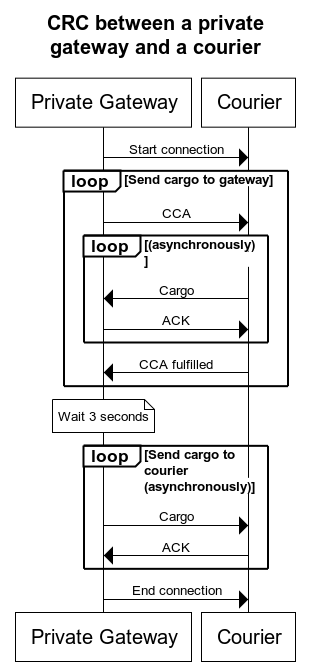

# Awala Core
{: .no_toc }

- Id: RS-000.
- Status: Working draft.
- Type: Implementation.
- Issue tracking label: [`spec-core`](https://github.com/AwalaNetwork/specs/labels/spec-core).

## Abstract
{: .no_toc }

This document describes the core elements of the Awala protocol suite, whose purpose is to make distributed systems tolerant to potentially large network latencies through the use of [asynchronous messaging](https://www.techopedia.com/definition/26454/asynchronous-messaging).

## Table of contents
{: .no_toc }

1. TOC
{:toc}

## Introduction

Distributed systems are typically integrated using some form of [Remote Procedure Call (RPC)](https://en.wikipedia.org/wiki/Remote_procedure_call), a seemingly simple and familiar pattern that resembles local function calls in programming. Systems communicating over HTTP, such as REST or gRPC APIs, employ this pattern.

RPCs work well in a reliable network -- One with a low [round-trip time (RTT)](https://en.wikipedia.org/wiki/Round-trip_delay_time) and an adequate [throughput](https://en.wikipedia.org/wiki/Throughput). But the component making the call becomes more complicated with the need to implement retries, timeouts and [circuit breakers](https://martinfowler.com/bliki/CircuitBreaker.html) in order to cope with an unusually high RTT or an unusually low throughput. And with an extremely high RRT and/or an extremely low throughput, RPCs do not work at all.

In contrast to RPCs, distributed systems using asynchronous messaging are implemented without any assumption that the data will reach its destination immediately or that a response will be returned. Instead, they communicate through [_brokers_](https://en.wikipedia.org/wiki/Message_broker) that receive, route and deliver the data.

Decoupling the two nodes in the connection makes it possible to transport the data using alternative methods when the network unavailable. For example, in places where [sneakernets](https://en.wikipedia.org/wiki/Sneakernet) are used to consume foreign content, people could also use it to connect their applications to the Internet if those applications were tolerant to large RTTs.

Awala makes it easy to build distributed systems using asynchronous messaging in such a way that data can be securely transported on alternative media (e.g., sneakernets) when a conventional computer network is unavailable. The result is a [delay-tolerant](https://en.wikipedia.org/wiki/Delay-tolerant_networking), [overlay](https://en.wikipedia.org/wiki/Overlay_network) network with [onion routing](https://en.wikipedia.org/wiki/Onion_routing).

Asynchronous messaging also happens to be a better integration style, for reasons that Hohpe and Woolf eloquently summarize in [Enterprise Integration Patterns](https://en.wikipedia.org/wiki/Enterprise_Integration_Patterns) (page 54):

> Asynchronous messaging is fundamentally a pragmatic reaction to the problems of distributed systems. Sending a message does not require both systems to be up and ready at the same time. Furthermore, thinking about the communication in an asynchronous manner forces developers to recognize that working with a remote application is slower, which encourages design of components with high cohesion (lots of work locally) and low adhesion (selective work remotely).

## Concepts

The following diagram illustrates the various components of the network and how they interact with each other:


- A **service** is a collection of _applications_ that communicate amongst themselves. If the sender or recipient is a server, the service is _centralised_; otherwise, the service is _decentralised_.
- **Applications** exchange _messages_ amongst themselves, and because they can't communicate directly, they each use an _endpoint_ as a broker.
- A **(service) message** is serialized in the format determined by the service and does not have to be encrypted or signed.
- An **endpoint** receives a message from its application and converts it into a _parcel_ for the target application's endpoint, and because they still can't communicate directly, they each use a _gateway_ as a broker. When an endpoint receives a parcel from the gateway, it has to decrypt the message and pass it to its application.
- A **parcel** encapsulates exactly one service message. Parcels are end-to-end encrypted and signed (with different keys).
- Two or more **gateways** relay parcels between endpoints. There are two types of gateways:
  - A **private gateway** runs on an end-user device and serves the endpoints on that device.
  - An **Internet gateway** relays parcels between its private gateways and the Internet.

  When a gateway needs to send parcels to another gateway without the Internet,
  it delegates the task to a _courier_.
  In this case, parcels are encapsulated in _cargoes_, which are end-to-end encrypted and signed,
  so that they can't be read or tampered with in transit.
  The receiving gateway then extracts the parcels from the cargo and passes them on to the next gateway or final endpoint.
- A **cargo** encapsulates one or more messages (e.g., parcels) between gateways. Cargoes are only used when the two gateways have to communicate via an untrusted broker (e.g., couriers). Cargoes are end-to-end encrypted and signed (with different keys).
- A **courier** is the individual, organization or technology that transports the cargo between gateways when they can't reach each other via the Internet. For example, it could be a sneakernet operated by volunteers or a [scatternet](https://en.wikipedia.org/wiki/Scatternet) operated by users themselves.

Gateways and endpoints are also collectively called **nodes**. Each node has an _identity key pair_ for [authentication](rs002-pki.md) and routing purposes. Couriers are not nodes.

For example, if Twitter supported Awala, Twitter would be a _service_ with Awala-compatible, mobile and server-side apps. The _endpoints_ in the mobile apps could simply be Java (Android) or Swift (iOS) libraries, whilst the server-side app will have `twitter.com` as the _Internet endpoint address_.

Awala can also be described in terms of the [OSI model](https://en.wikipedia.org/wiki/OSI_model) as shown in the diagram below -- With [same-layer and adjacent-layer interactions](https://upskilld.com/learn/same-layer-and-adjacent-layer-interactions/) defined by [_messaging protocols_](#messaging-protocols) and [_message transport bindings_](#message-transport-bindings), respectively.


Note that defining same-layer interactions at the application and relay layers is outside the scope of the protocol suite. Awala only prescribes the interactions with their adjacent layers. Each service has full control over its applications (see [_service messaging protocol_](#service-messaging-protocol)), and each courier has full control over its relay layer.

## Addressing

This document only defines [point-to-point](https://www.enterpriseintegrationpatterns.com/patterns/messaging/PointToPointChannel.html) message delivery.

Each node MUST be uniquely identified with an ASCII-encoded _id_ equal to the `0` (zero) character (denoting the first version of the id format), followed by the SHA-256 digest of the DER encoding of the identity public key as a `SubjectPublicKeyInfo` structure from [RFC 5280](https://tools.ietf.org/html/rfc5280). For example, `0b5bb9d8014a0f9b1d61e21e796d78dccdf1352f23cd32812f4850b878ae4944c` is a valid id.

If the node is also directly reachable from the Internet (i.e., it is an Internet host), the node would be known as an _Internet endpoint_ or an _Internet gateway_, and it would be subject to the [Internet address resolution](#internet-address-resolution) below.

## Messaging Protocols

These protocols establish the corresponding [_channels_](https://www.enterpriseintegrationpatterns.com/patterns/messaging/MessageChannel.html) for applications, endpoints and gateways. Building on the OSI model mapping above, these protocols define the [same-layer interactions](https://upskilld.com/learn/same-layer-and-adjacent-layer-interactions/).

Endpoints and gateways MUST comply with the [Awala PKI profile](rs002-pki.md), which specifies the use of certificates in these protocols. The [Internet PKI profile](https://tools.ietf.org/html/rfc5280) does not apply to messaging protocols.

Endpoint and gateway channels transmit two types of messages:

- Payload-carrying messages, which MUST be serialized with the [Awala Abstract Message Format (RAMF)](rs001-ramf.md). Nodes and couriers MUST enforce the post-deserialization validation described in the RAMF specification on every message they receive.
- Control messages, which allow the two nodes to coordinate their work. Such messages are serialized with ASN.1/DER.

Each message format MUST begin with a 10-octet-long format signature that declares the type of the message:

1. Prefix (8 octets): "Awala" in ASCII (hexadecimal sequence: `52 65 6c 61 79 6e 65 74`).
1. Concrete message type (1 octet).
1. Concrete message format version (1 octet). 

### Service Messaging Protocol

This protocol establishes the channel between two applications in a service. The _service provider_ has full control over this protocol, including the types of messages that its applications exchange (their contents, serialization format, etc).

Applications MAY provision [_Parcel Delivery Authorizations_ (PDAs)](rs002-pki.md#parcel-delivery-authorization-pda) from their corresponding endpoints. PDAs MUST be encapsulated in service messages; for example, an application sends a message to another application in order to subscribe to updates, the authorizing application could attach the PDA to the message.

### Endpoint Messaging Protocol

This protocol establishes the bidirectional channel between two endpoints. The only type of message that this specification defines at this level is the [_parcel_](#parcel).

#### Parcel

A parcel encapsulates a service message and is serialized with RAMF, using the octet `0x50` ("P" in ASCII) as its _concrete message type_.

In order to make parcels fit in [cargo](#cargo) messages, a parcel MUST NOT span more than 8322037 octets.

The parcel payload MUST be encrypted. The corresponding plaintext MUST contain the service message and its media type, and it MUST be at least 65 KiB below the overall limit for a parcel (i.e., the payload plaintext MUST NOT be longer than 8256501 octets). The plaintext MUST be serialized with the following binary sequence (little-endian):

1. An 8-bit unsigned integer (1 octet) representing the length of the service message type.
1. A UTF-8 encoded string representing the type of the service message. For example, `application/x-protobuf; messageType="twitter.Tweet"`.
1. A 23-bit unsigned integer (3 octets) representing the length of the service message.
1. The service message serialized in the format dictated by the service.

### Gateway Messaging Protocol

This protocol establishes the channel between two gateways, and its primary purpose is to facilitate the delivery of messages from the endpoint messaging protocol over the underlying network that is available at any point in time (e.g., the Internet, a sneakernet).

The two gateways MUST maintain a single session using the [Channel Session Protocol](rs003-key-agreement.md), and all keys used to encrypt payloads in this channel MUST be derived from that session.

In addition to relaying messages from the endpoint messaging protocol (e.g., parcels), this protocol supports the following messages.

#### Parcel Collection Acknowledgement (PCA) {#pca}

A Parcel Collection Acknowledgement (PCA) is a control message used to signal to the peer gateway that the specified parcel(s) has been received and safely stored; its concrete message type is the octet `0x51`. The gateway that sent the original parcels SHOULD permanently delete such parcels at that point.

The payload plaintext MUST be serialized with ASN.1/DER using the following schema:

```
ParcelCollectionAcknowledgement ::= SEQUENCE {
    senderEndpointId     VisibleString,
    recipientEndpointId  VisibleString,
    parcelId             VisibleString
}
```

Where `senderEndpointId` represents the sender's id, `recipientEndpointId` is the target endpoint's id and `parcelId` represents the RAMF message id of said parcel.

#### Parcel Delivery Deauthorization (PDD) {#pdd}

A Parcel Delivery Deauthorization (PDD) revokes one or more PDAs issued by a specific endpoint. It MAY be requested by the endpoint itself or its gateway. Regardless of which node initiated the PDD, the message sent to the peer gateway MUST have the following structure:

- The id for the endpoint whose PDAs should be revoked.
- Serial numbers of the PDAs to revoke. It may be empty to revoke all the PDAs issued by the endpoint.
- Expiry date of the deauthorization. If revoking all PDAs from the endpoint, this MUST be the expiry date of the endpoint certificate. If revoking specific PDAs, this MUST be the expiry date of the PDA with the latest expiry date.

The message MUST be serialized as the DER representation of the `ParcelDeliveryDeauthorization` ASN.1 type defined below:

```
ParcelDeliveryDeauthorization ::= SEQUENCE
{
  recipientAddress  VisibleString (SIZE(0..1024)),
  pdaSerialNumbers  SET OF INTEGER,
  expiryDateUtc     DATE-TIME
}
```

Gateways MUST enforce PDDs for as long as they are active. Internet gateways MAY additionally cache PDDs until they expire in order to refuse future parcels whose PDA has been revoked.

#### Gateway Certificate Rotation (GCR) {#gcr}

When fulfilling cargo collection requests, Internet gateways MUST check if their private peers' certificates are eligible for rotation per [RS-002](./rs002-pki.md#certificate-rotation). If that is the case, they MUST issue a new certificate and include it as a _Gateway Certificate Rotation_ (GCR) message in one of the cargoes output.

Similarly, a private gateway MUST process the certificate contained in a GCR message following the rules defined in [RS-002](./rs002-pki.md#certificate-rotation).

Internet gateways MUST ignore any GCR received from a peer, as that is not supported.

A GCR message MUST be serialized as a `CertificateRotation` message defined in [RS-002](./rs002-pki.md#certificate-rotation).

#### Cargo

Its sole purpose is to encapsulate one or more messages from the gateway channel (e.g., parcels) when the gateways are unable to communicate securely directly and have to resort to a potentially untrusted courier.

Cargoes MUST be serialized with RAMF, using the octet `0x43` ("C" in ASCII) as its concrete message type. Couriers and gateways MUST enforce the post-deserialization validation described on the RAMF specification.

The payload ciphertext MUST be encrypted. The corresponding plaintext MUST encapsulate zero or more messages (e.g., parcels), and it MUST be serialized as the DER representation of the `CargoMessageSet` ASN.1 type defined below:

```
CargoMessageSet ::= SEQUENCE OF Message
Message ::= OCTET STRING
```

Where each `Message` is the binary serialization of each message contained in the cargo. Implementations SHOULD encapsulate messages into as few cargoes as possible.

Note that as the encrypted payload of a RAMF message, the `CargoMessageSet` serialization cannot be greater than 8322048 octets. Consequently, each `Message` MUST NOT span more than 8322037 octets long to account for the encoding of the type and length prefix in DER.

A cargo MUST NOT be encapsulated in another cargo.

#### Cargo Collection Authorization (CCA) {#cca}

A Cargo Collection Authorization (CCA) is a RAMF-serialized message whereby Gateway A (the sender) allows a courier to collect cargo on its behalf from Gateway B (the recipient). Its concrete message type MUST be the octet `0x44`. CCAs MUST NOT be encapsulated in cargo to enable the courier to process and send the CCA to target gateway.

Every CCA MUST contain an encrypted Cargo Collection Request (CCR) as its payload. The CCR MUST be serialized with ASN.1/DER using the following schema:

```
CargoCollectionRequest ::= SEQUENCE {
   cargoDeliveryAuthorization  OCTET STRING
}
```

Where `cargoDeliveryAuthorization` is the DER-encoded, Awala PKI certificate for the [Cargo Delivery Authorization (CDA)](./rs002-pki.md#cargo-delivery-authorization-cda) issued by Gateway A to Gateway B.

### Node Connection Parameters

Nodes MAY use the _Node Connection Parameters_ (NCP) format to share their connection parameters in a standard format, defined as follows in ASN.1/DER:

```
NodeConnectionParameters ::= SEQUENCE {
    internetAddress  VisibleString,
    identityPublicKey  OCTET STRING,
    sessionKey  SessionKey
}

SessionKey ::= SEQUENCE {
   id OCTET STRING,
   publicKey OCTET STRING
}
```

Where:

- `internetAddress` is the Internet address of the node.
- `identityPublicKey` is the DER serialization of the public key in the node's identity key pair per [RS-002](./rs002-pki.md).
- `sessionKey` represents the node's session key pair per [RS-003](./rs003-key-agreement.md). This sequence is further defined as follows:
  - `id`: the unique identifier of the key pair.
  - `publicKey`: the DER serialization of the public key.

## Message Transport Bindings

A message transport binding, or simply _binding_, defines the [adjacent-layer interactions](https://upskilld.com/learn/same-layer-and-adjacent-layer-interactions/) in Awala. Its objective is to facilitate the exchange of messages in endpoint and gateway messaging protocols (e.g., parcels, cargoes, acknowledgements). This document describes the requirements applicable to all bindings, but does not define any concrete binding.

Bindings will typically leverage [Layer 7](https://en.wikipedia.org/wiki/Application_layer) protocols, such as HTTP or purpose-built ones, but they can also use an Inter-Process Communication (IPC) mechanism provided by the host system.

Communication MUST be encrypted when the two nodes are on different computers, otherwise it is optional. Communication is deemed to happen on the same computer when either the loopback network interface (i.e., addresses in the range `127.0.0.0/8`) or IPC is used. When encryption is used, it MUST be provided by Transport Layer Security (TLS) version 1.3 ([RFC 5246](https://tools.ietf.org/html/rfc5246)) or newer, or an equivalent technology in non-TCP connections (e.g., [DTLS](https://en.wikipedia.org/wiki/Datagram_Transport_Layer_Security)). When using TLS, Server Name Identification per [RFC 6066](https://tools.ietf.org/html/rfc6066) MUST be supported by clients and it MAY be used by servers.

For performance reasons, nodes SHOULD use Unix domain sockets or any other IPC mechanism instead of the loopback network interface when they are on the same computer.

For availability and performance reasons, the node sending messages SHOULD limit the number of messages pending acknowledgements to five. Consequently, the node on the receiving end MUST hold at least five incoming messaging in its processing queue at any point in time. The receiving end MAY close the connection when this limit is exceeded.

For privacy and censorship-circumvention reasons, Internet addresses using DNS records SHOULD be resolved using [DNS-over-HTTPS](https://tools.ietf.org/html/rfc8484) or [DNS-over-TLS/DTLS](https://tools.ietf.org/html/rfc8310), using a DNS resolver trusted by the implementer. Implementations MAY allow advanced users to set the DNS resolver. Additionally, when the connection is done over TLS 1.3 or newer, the [Encrypted Server Name Identification extension](https://tools.ietf.org/html/draft-rescorla-tls-esni-00) SHOULD be used.

The node delivering a message MUST NOT remove it until the peer has acknowledged its receipt. The acknowledgement MUST be sent after the message is safely stored. For example, if the message is being saved to a local disk, its receipt MUST be acknowledged after calling [`fdatasync`](https://linux.die.net/man/2/fdatasync) (on Unix-like systems) or [`FlushFileBuffers`](https://docs.microsoft.com/en-us/windows/win32/api/fileapi/nf-fileapi-flushfilebuffers) (on Windows).

Bindings MAY extend this specification, but they MUST NOT override it.

### Internet Address Resolution

The Internet address MUST be a DNSSEC-secured domain name resolved as an [SRV record](https://tools.ietf.org/html/rfc2782) whose service name and OSI Layer 4 protocol are to be defined in extensions to this specification.

The target host in the SRV record MUST be used exclusively in the client-server connection. For example, if the Awala Internet node `example.com` resolves to the host `foo.example.com`, then `foo.example.com` should be specified in the TLS Server Name Identification (SNI) value and the HTTP `Host` request header (assuming that the binding uses the TLS and HTTP protocols).

The node Internet address MUST NOT be used as the host in the TLS/HTTP connection in order to allow the same Internet node to share a single public IP address across its binding implementations. However, to prevent hijacking through DNS spoofing, clients MUST use DNSSEC and refuse results whose DNSSEC validation fails. A client MAY delegate DNSSEC validation to a trusted DNS-over-HTTPS or DNS-over-TLS/DTLS resolver.

### Gateway Synchronization Binding

This is a protocol that establishes a _Gateway Synchronization Connection_ (GSC) between a private node (a private endpoint or a private gateway) and its gateway, with the primary purpose of exchanging parcels bidirectionally. The private node and its gateway MUST act as the client and server, respectively.

Before the nodes can exchange parcels, the private node MUST register with its gateway. If the gateway behind the server accepts the registration, it MUST issue a [Awala PKI certificate](rs002-pki.md) to the private node. The private node MUST use its certificate to sign requests to exchange parcels with its gateway.

If the server corresponds to a private gateway, it SHOULD listen on port `276` if it has the appropriate permission to do so or port `13276` if it does not. Alternatively, if using Unix domain sockets, the client SHOULD NOT initiate a connection if the socket is owned by a user other than the administrator (`root` in Unix-like systems).

If the server corresponds to a Internet gateway, it MUST use `awala-gsc` as the service string in the SRV record.

In addition to sending parcels to each other, the client MAY also register [Parcel Delivery Deauthorizations (PDD)](#pdd) with the server.

##### Parcel collection handshake

As soon as the connection is established, a handshake MUST be performed for the gateway to authenticate the private node(s). The client will be challenged to sign a nonce with the key of each private node it claims to own, as shown in the following sequence diagram.


The connection MUST be closed if the handshake fails.

### Parcel Delivery Binding

This is a protocol that establishes a _Parcel Delivery Connection_ (PDC), whose sole purpose is to allow gateways and Internet endpoints to deliver parcels to Internet nodes. In this case, the sender and the recipient will act as client and server, respectively.

If the recipient is a Internet gateway, it MUST override any previously queued parcel with the same id. The sending endpoint MAY use this to replace stale messages in the same relay -- For example, an application sending a message to replace the user's email address could use this to discard any previous message to replace this value.

The server MUST NOT require client authentication, but it MAY still refuse to serve suspicious, ill-behaved or abusive clients.

If the client is a private or Internet gateway, it SHOULD include the Internet address of the corresponding Internet gateway if that gateway is able to collect parcels for the endpoint that sent the parcel.

The client MUST close the underlying connection as soon as all parcels have been delivered.

Servers MUST use `awala-pdc` as the service string for the SRV record corresponding to their PDC server(s).

PDCs MUST always use TLS (or equivalent in non-TCP connections).

### Cargo Relay Binding

This is a protocol that establishes a _Cargo Relay Connection_ (CRC) between a gateway and a courier with the primary purpose of exchanging cargo bidirectionally. Consequently, this is only applicable when the underlying network is a sneakernet.

The action of transmitting a cargo over a CRC is called _hop_, and the action of transmitting a cargo from its origin gateway to its target gateway is _relay_. There are two hops in the relay of a cargo: One from its origin gateway to a courier and another from the courier to its target gateway. A courier MAY also act as a gateway to exchange cargo with another courier via a CRC, in which case the number of hops will increase accordingly.

To establish a CRC between a private gateway and a courier, the operator of the courier MUST first make the courier available for incoming connections from such gateways. Then the private gateway MUST initiate the connection subject to the approval of the operator of the device running the gateway. In this scenario, the gateway and the courier will play the roles of client and server, respectively.

On the other hand, to establish a CRC between a courier and a Internet gateway, the courier MUST initiate a CRC connection with each gateway for which any cargoes and/or CCAs are bound. In this scenario, the courier and the gateway will play the roles of client and server, respectively.

When a CRC is established, the following process should be done sequentially:

1. Any cargo in the courier bound for the current gateway MUST be delivered, and the gateway MUST acknowledge the receipt of each cargo as soon as it is safely stored.

   How this step is initiated will depend on the type of node acting as the client:
   
   - When the client is a private gateway, it MUST initiate this step by sending one or more CCAs to the courier and the courier MUST then return all the cargo it holds for each gateway, if any. The courier MUST persist those CCAs so it can send them to their respective target gateways when collecting cargo from them in the future.
   - When the client is a courier, it MUST simply deliver the cargo bound for the current gateway, if any.
   
   The current gateway MUST ignore cargo whose sender's certificate was not issued by its own self-issued certificate.
1. No further cargoes SHOULD be exchanged for at least 5 seconds to allow sufficient time for the gateway to (a) deliver the parcels contained in the cargo to their corresponding endpoints and (b) collect any new parcels that those endpoints might have automatically produced in response to the parcels they received.
  
   The underlying connection (e.g., a TCP connection) MAY be closed during this time, in which case a new connection will have to be created when resuming this process.
   
   This step SHOULD be skipped when the courier did not deliver any cargo to the gateway in the previous step.
1. The gateway MUST send to the courier any cargo it wants the courier to relay, and the courier MUST acknowledge the receipt of each cargo as soon as it is safely stored.

   How this step is initiated will depend on the type of node acting as the client:
   
   - When the client is a courier, it MUST initiate this step by sending one or more CCAs to the Internet gateway and the Internet gateway MUST then return all the cargo it holds for the gateway of each CCA, if any. Additionally, the Internet gateway MUST sign the cargo with the Cargo Delivery Authorization contained in the respective CCA.
   - When the client is a private gateway, it MUST simply deliver the cargo bound for its peer gateway, if any.
   
   The client MUST close the underlying connection at the end of this step.

When a client sends a CCA, the server MUST notify the client when it is done sending cargo for that CCA, even if no cargo was sent. The client SHOULD resend a CCA one last time when the server does not finish processing it within 5 seconds since the CCA was sent or the last cargo was received, whichever happened last. Couriers MUST NOT reuse CCAs when collecting cargo from a Internet gateway, so each CCA SHOULD be discarded as soon as the gateway confirms it completed processing it.

Cargoes SHOULD be redelivered one last time when they are not acknowledged within 5 seconds since their delivery.

The following diagram illustrates the binding between a private gateway and a courier:



And the following diagram illustrates the binding between a courier and a Internet gateway:


Gateways SHOULD defer the encapsulation of parcels and other messages into cargo until they are about to send it to the courier as that would allow them to exclude expired messages and send as few cargoes as possible. They MAY, however, set a creation date in the past to prevent an eavesdropper from tracking the time when the CRC took place.

Gateways MUST NOT delete parcels as a consequence of encapsulating them in cargo sent to couriers as that would be incompatible with the requirements of the [Parcel Delivery Binding](#parcel-delivery-binding) (there is no guarantee that the courier will be able to deliver those parcels before they expire).

Note that couriers are not assigned Awala PKI certificates, but per the requirements for bindings in general, TLS certificates or equivalent must be used when the connection spans different computers. Consequently, the node acting as server MUST provide a valid certificate which MAY NOT be issued by a Certificate Authority trusted by the client when the server is a courier: Couriers are unlikely to get certificates issued by widely trusted authorities because they are not Internet hosts, but this is deemed to be acceptable from a security standpoint because the purpose of TLS (or equivalent) in this case is to provide confidentiality from eavesdroppers, not to authenticate the server.

Internet gateways MUST use `awala-crc` as the service string for the SRV record corresponding to their CRC server(s).

CRC servers in couriers SHOULD listen on port `21473`, which stands for "too late".

## Clock Drift Tolerance

Devices disconnected from the Internet will not typically have the ability to keep their clocks in synchronization with the current time. This situation, commonly known as _clock drift_, will be particularly bad in old devices that have never been connected to the Internet, and it could be exacerbated with a recent daylight saving time switch.

For this reason, Awala implementations SHOULD be tolerant to clock drifts of up two hours in all channel- or binding-level communications where at least one of the peers is a private node. For instance, this tolerance applies to the validity period of RAMF messages and Awala PKI certificates, as well as the validity of TLS certificates of couriers in a CRC.

For the avoidance of doubt, this recommendation does not apply to the CRC between a courier and a Internet gateway because neither peer is a private node. Consequently, in this scenario, couriers are still required to refuse any TLS certificate that is not valid at the time the connection takes places, but it is still recommended that the Internet gateway be tolerant to a potential clock drift in the channels with private gateways.

## Open Questions

- This specification only defines how to make Awala work on sneakernets. Maybe all the definitions specific to sneakernets should be moved to a separate spec so the core spec is agnostic of the relay layer? Using the Internet as the relay layer is already in a separate spec ([RS-017](rs017-adaptive-relay.md)).
