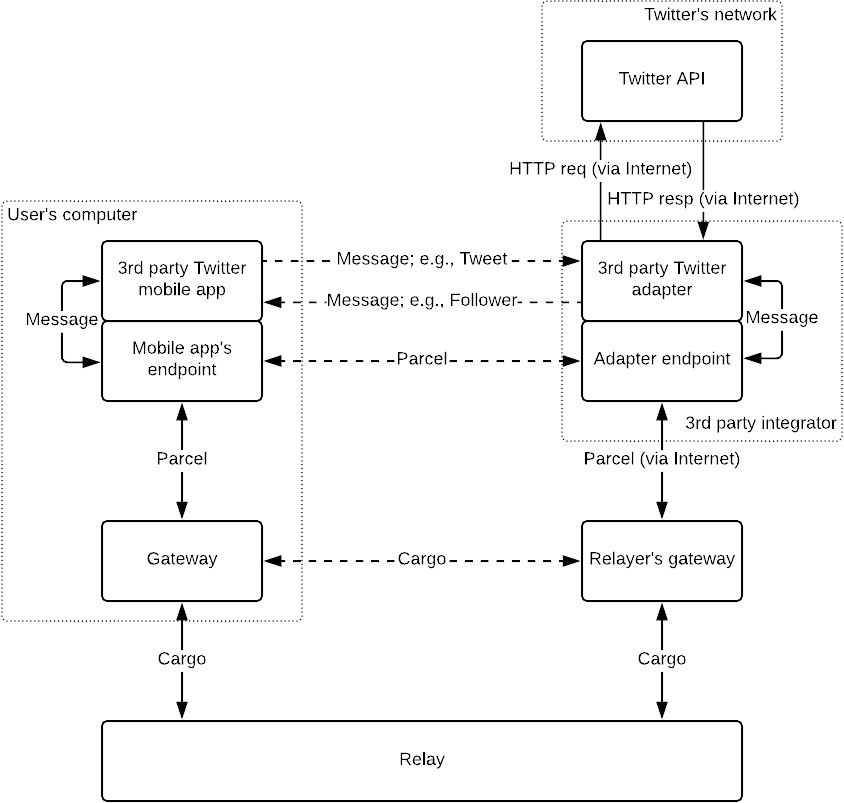
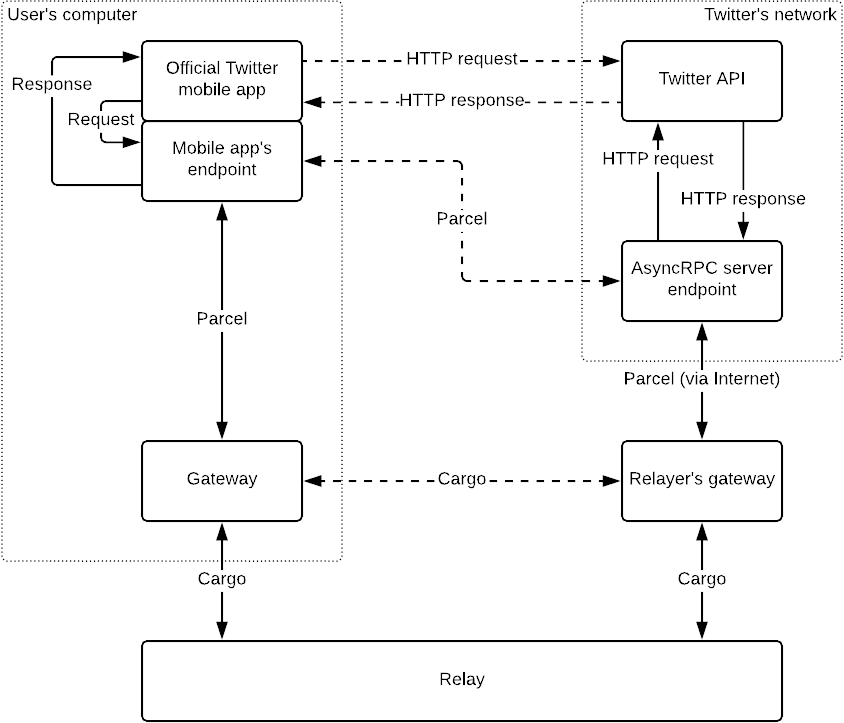
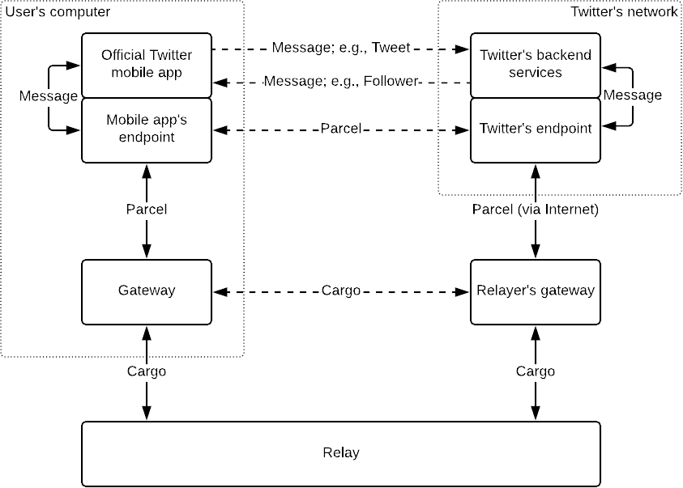
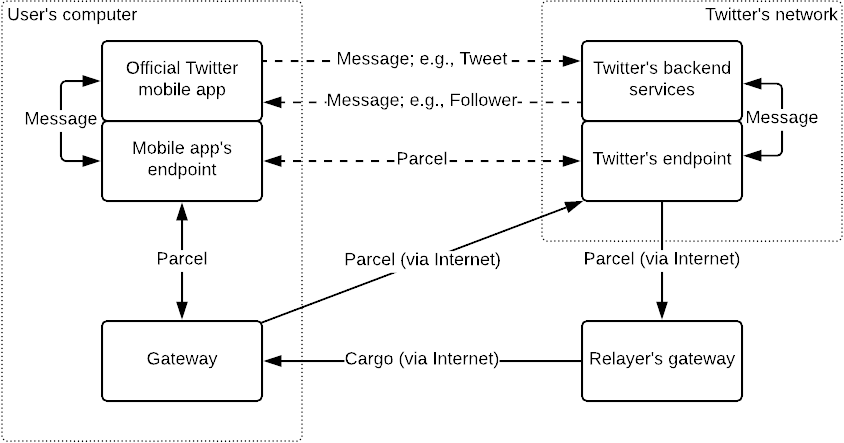

# Service Integration Scale

- Id: RS-012.
- Status: Working draft.
- Type: Informational.

## Abstract

This document categorizes the degrees to which Relaynet can be integrated in a centralised or decentralised service.

## Categorization

### RPC Encapsulation vs Messaging

RPC encapsulation using a Relaynet service like [RS-011 (AsyncRPC)](rs011-asyncrpc.md).

### Third Party vs First Party Endpoints

If the server-side endpoint is run by a third party, end-to-end encryption cannot be achieved because the message's plaintext will be exposed to the third-party endpoint.

## Levels

### Level 5: Unsupported

The service does not support Relaynet.

### Level 4: Third-party RPC encapsulation

The service does not officially support Relaynet, but a third party integrator is using AsyncRPC on top of the service's original RPC interface. The following diagram illustrates this scenario with Twitter:

Unless the original messages are also encrypted with the RPC server's key, this integration does not offer end-to-end encryption because the messages will be available as plaintext to the AsyncRPC server run by the third party.

### Level 3: Third-party messaging adapter

The service does not officially support Relaynet, but a third party integrator has created a custom adapter endpoint that uses asynchronous messaging with its client endpoints, whilst translating each incoming message into one or more RPCs, and combining such responses into one or more messages.

The following diagram illustrates this scenario with Twitter:

Unless the original messages are also encrypted with the RPC server's key, this integration does not offer end-to-end encryption because the messages will be available as plaintext to the third-party adapter and endpoint.

### Level 2: First-party RPC encapsulation

The service officially supports Relaynet by running its own AsyncRPC instance on top of the original RPC interface, thus offering end-to-end encryption because the cleartext is never accessible to a third party.

The following diagram illustrates this scenario with Twitter:

### Level 1: First-party messaging adapter

The service officially support Relaynet through a custom adapter endpoint that uses asynchronous messaging with its client endpoints, whilst translating each incoming message into one or more RPCs, and combining such responses into one or more messages. This integration offers end-to-end encryption.

The following diagram illustrates this scenario with Twitter:

### Level 0: Relaynet native

The service was built using asynchronous messaging with Relaynet instead of RPCs, thus offering end-to-end encryption and lower overhead. It might, however, offer an RPC adapter for convenience for third party integrators.

The following diagram illustrates this scenario with Twitter:

A service may eventually reach this level because it may be too expensive to support both Relaynet and the original RPC interface. Note that Relaynet can also be used when the two applications are connected to the Internet and there's no need to relay the data physically:

To keep latency low, the user's gateway can operate in [cut-through mode](https://en.wikipedia.org/wiki/Cut-through_switching) when it can reach the target endpoint. Otherwise, it would remain in [store-and-forward mode](https://en.wikipedia.org/wiki/Store_and_forward), delivering the parcel to the target endpoint when it can eventually reach the endpoint. This technique can be seen as a form of [adaptive switching](https://en.wikipedia.org/wiki/Adaptive_switching).
