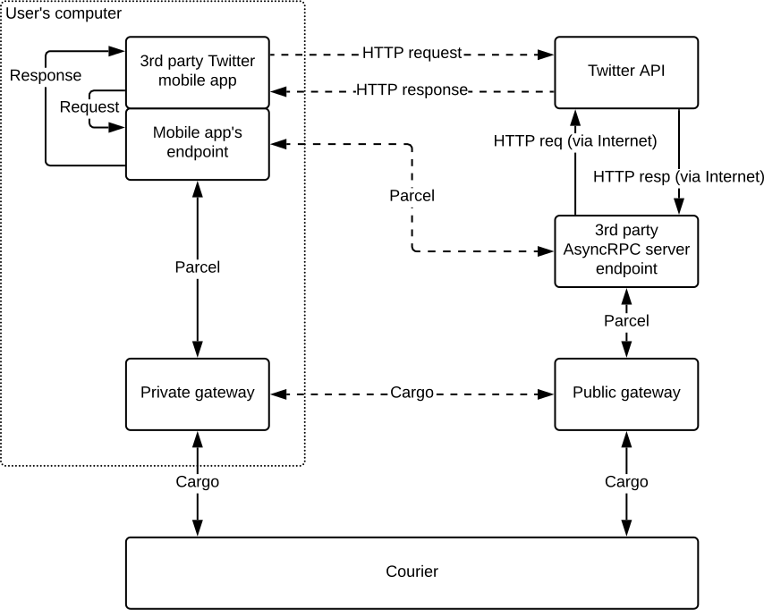
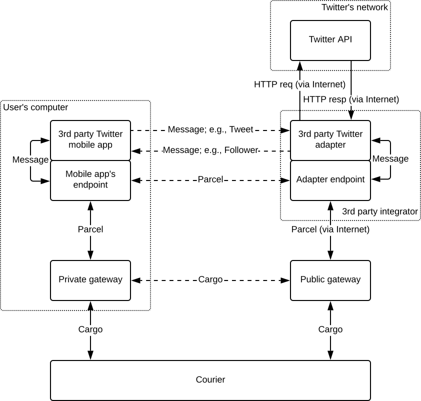
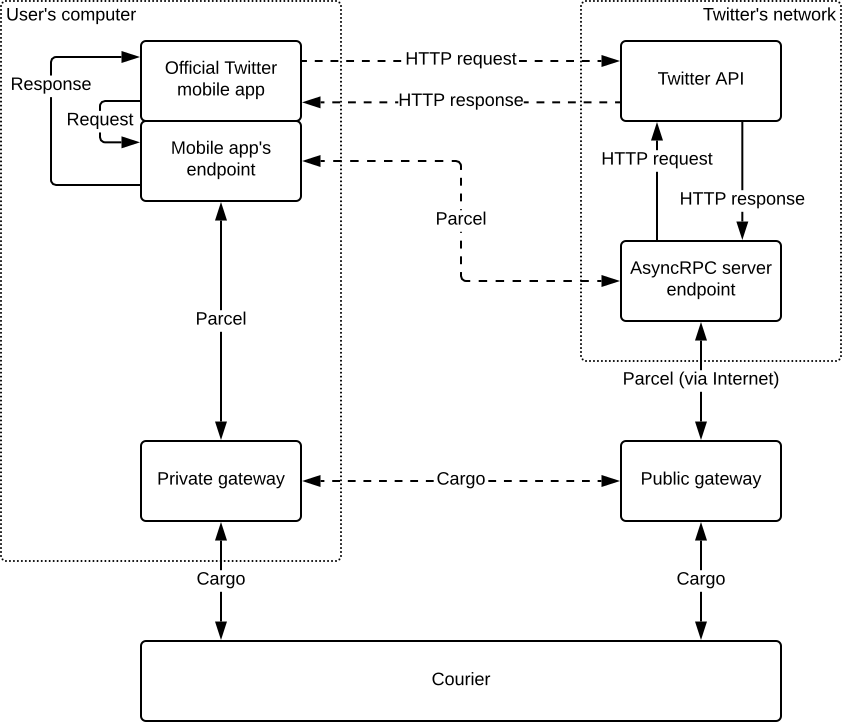
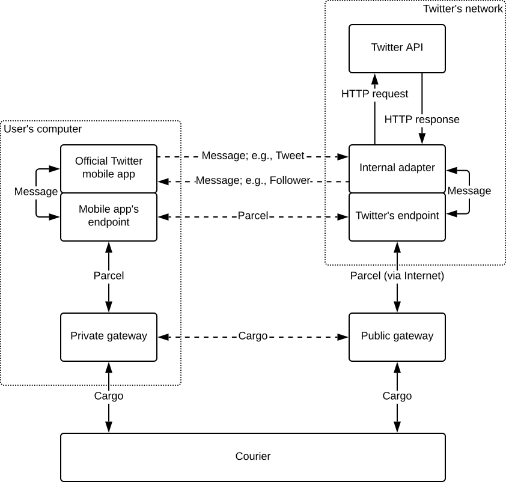
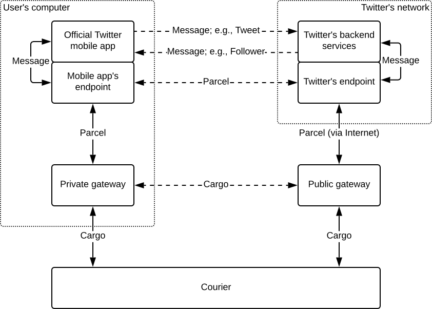

# Service Integration Scale
{: .no_toc }

- Id: RS-012.
- Status: Working draft.
- Type: Informational.

## Abstract
{: .no_toc }

This document categorizes the degrees to which Awala can be integrated in a centralised or decentralised service.

## Table of contents
{: .no_toc }

1. TOC
{:toc}

## Categorization

There are two orthogonal dimensions to consider when classifying the Awala integration in a service:

- **Messaging vs RPC encapsulation**. A service is doing RCP encapsulation when its applications continue use the RPC pattern on top of Awala. For example, there are still REST API calls, perhaps using [RS-011 (AsyncRPC)](rs011-asyncrpc.md) or something similar. Embracing asynchronous messaging is the recommended way to use Awala, but in some cases it may be desirable to start adopting Awala by encapsulating existing RPCs.
- **First party vs third party integration**. A service has first party integration when the service provider itself operates the endpoints. A third party may operate endpoints for a service that otherwise would be incompatible, with the caveat that the end-to-end encryption will end with the third-party integrator unless the main service encrypts its messages as well.

## Levels

### Level 5: Unsupported

The service does not support Awala.

### Level 4: Third-party RPC encapsulation

The service does not officially support Awala, but a third party integrator is using AsyncRPC on top of the service's original RPC interface. The following diagram illustrates this scenario with Twitter:

Unless the original messages are also encrypted with the RPC server's key, this integration does not offer end-to-end encryption because the messages will be available as plaintext to the AsyncRPC server run by the third party.

### Level 3: Third-party messaging adapter

The service does not officially support Awala, but a third party integrator has created a custom adapter endpoint that uses asynchronous messaging with its client endpoints, whilst translating each incoming message into one or more RPCs, and combining such responses into one or more messages.

The following diagram illustrates this scenario with Twitter:

Unless the original messages are also encrypted with the RPC server's key, this integration does not offer end-to-end encryption because the messages will be available as plaintext to the third-party adapter and endpoint.

### Level 2: First-party RPC encapsulation

The service officially supports Awala by running its own AsyncRPC instance on top of the original RPC interface, thus offering end-to-end encryption because the cleartext is never accessible to a third party.

The following diagram illustrates this scenario with Twitter:

### Level 1: First-party messaging adapter

The service officially support Awala through a custom adapter endpoint that uses asynchronous messaging with its client endpoints, whilst translating each incoming message into one or more RPCs, and combining such responses into one or more messages. This integration offers end-to-end encryption.

The following diagram illustrates this scenario with Twitter:

### Level 0: Awala native

The service was built using asynchronous messaging with Awala instead of RPCs, thus offering end-to-end encryption and lower overhead. It might, however, offer an RPC adapter for convenience for third party integrators.

The following diagram illustrates this scenario with Twitter:

A service may eventually reach this level because it may be too expensive to support both Awala and the original RPC interface. Note that [Awala can still be used when the Internet is available](rs017-adaptive-relay.md).
