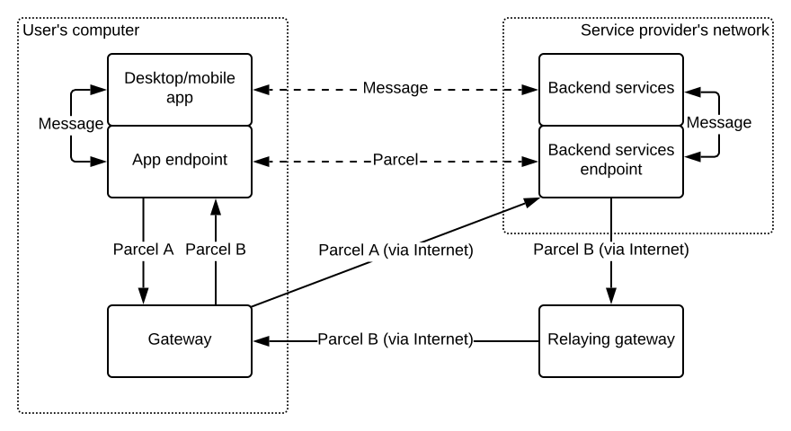

# Adaptive Relay
{: .no_toc }

- Id: RS-017.
- Status: Working draft.
- Type: Implementation.

## Abstract
{: .no_toc }

This specification extends [Relaynet Core (RS-000)](rs000-core.md) to keep latencies low when the underlying network (e.g., the Internet) is available.

## Table of contents
{: .no_toc }

1. TOC
{:toc}

## Introduction

Relaynet was originally conceived to connect two nodes that might never be connected through a traditional network infrastructure, so a [store-and-forward pattern](https://en.wikipedia.org/wiki/Store_and_forward) was naturally adopted. With this approach, the data travels through one or more intermediaries, where each will keep a copy of the data until it safely reaches the next node in the route.

This approach helps ensure that data will reach its destination, but it adds latency and complexity when the two nodes can actually communicate directly -- For example, when the Internet is available.

In those cases where the target endpoint of a parcel can be reached, the gateway could deliver the parcel immediately and directly, without a relayer or a relaying gateway. It may even start transmitting the parcel as soon as the first few bytes are received, since the target endpoint is one of the first few fields in a [RAMF](rs001-ramf.md) message. This approach is known as [cut-through mode](https://en.wikipedia.org/wiki/Cut-through_switching) in networking.

When a gateway operates in cut-through mode, it will not use a [Cargo Relay Binding](rs000-core.md#cargo-relay-binding) to connect to a relayer. Instead, it will use a binding for [internal Parcel Delivery Connections (PDCs)](rs000-core.md#internal-pdc) to get incoming parcels from its relaying gateway. 

The following diagram shows how parcels would be delivered in a centralized service (one with clients and servers) using cut-through mode:

Note that bindings will remain unchanged, but the roles of client and server would change: The user gateway will become an [external PDC](rs000-core.md#external-pdc) client to public endpoints and an internal PDC client to the relaying gateway. Similarly, this will be transparent to applications and endpoints, and only gateways need to be changed to support this specification.

The role of the relaying gateway in this scenario would be analogous to that of [STUN](https://en.wikipedia.org/wiki/STUN) servers: To allow computers in private networks to get data from the Internet as if they were Internet hosts.

This technique can be seen as a form of [adaptive switching](https://en.wikipedia.org/wiki/Adaptive_switching) in computer networking -- Hence the name of this specification.

## Internal PDC Between Gateways

The internal PDC between the user gateway and the relaying gateway will be almost identical to one between an endpoint and its gateway, except that the user gateway MUST NOT deliver parcels to the relaying gateway.

Given the nature of the connection, when the user gateway requests a certificate from the relaying gateway, it would be requesting a [Gateway Certificate](rs002-pki.md#gateway-certificate) for itself.

The user gateway SHOULD send any [Parcel Delivery Deauthorizations (PDDs)](rs002-pki.md#parcel-delivery-deauthorization-pdd) before signalling that it is ready to collect parcels, so that the relaying gateway can discard any parcels that should not be sent.

## Store-and-Forward vs Cut-Through Mode Selection

The user gateway MUST attempt to deliver each parcel to its target endpoint immediately, unless the gateway can be certain that the endpoint will not be reachable.

For example, if the gateway has the ability to know whether the computer is connected to the Internet, it could preemptively run in store-and-forward mode with parcels that should reach the Internet.

## Open Questions

- How can the user gateway send [key rotation](rs002-pki.md#certificate-and-key-rotation) and [certificate revocation](rs002-pki.md) messages? Maybe bindings for internal PDCs should be changed so that the _parcel delivery_ and _parcel delivery acknowledgement_ messages becomes more generic, like _message delivery_ and _message delivery acknowledgement_, respectively.
- Should user gateways be allowed to deliver parcels via its relaying gateway as well? That would effectively negate the need for VPNs when using Relaynet.
